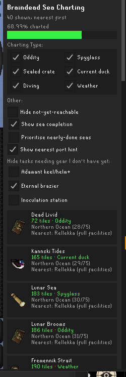

# Braindead Sea Charting

A [RuneLite](https://runelite.net) plugin for **Sailing**: a Quest Helper-style side panel for the
358-task sea-charting grind. Nearest incomplete task first, auto-advancing as you chart.



## Why

Sailing's sea charting has **358 individual chart tasks** spread across every ocean, each gated by
its own Sailing level (and sometimes a quest). The existing Plugin Hub **Sailing** plugin (by
LlemonDuck) highlights nearby chartable locations on the map/minimap once you're standing next to
one, but it doesn't show which of the 358 you're missing from anywhere, or what's fastest to do
next.

quest-helper already ships a working sea-charting sidebar
([`ChartingHelper`](https://github.com/Zoinkwiz/quest-helper/pull/2431), merged Nov 2025): per-sea
sections, a sorted/proximity toggle, auto-hiding finished seas, fading tasks you don't meet
requirements for. Two earlier Plugin Hub submissions covering similar ground
([#9556](https://github.com/runelite/plugin-hub/pull/9556),
[#9597](https://github.com/runelite/plugin-hub/pull/9597)) were closed citing it.

### Comparison to quest-helper's ChartingHelper

| | quest-helper's `ChartingHelper` | This plugin |
|---|---|---|
| Per-sea progress | Plain text, no exact count | Numeric **"(x/y)"** counter per sea, live |
| Sort | Binary toggle: alphabetical or proximity | Weighted blend: proximity, but a sea's last 1-2 tasks get a bounded priority bump so you finish it before moving on (reasoning in `SeaChartTaskSorter`'s Javadoc); degrades to pure proximity for seas with lots left |
| Gear hazards | Not covered | Filters for adamant keel/helm, eternal brazier, inoculation station, sourced from the OSRS Wiki's hazard-sea pages |
| Routing | None | Optional [Shortest Path](https://github.com/Skretzo/shortest-path) integration: click a row (or a two-stage task auto-fires it) and it draws a route |
| Two-stage tasks (Weather / Current duck) | Not specifically handled | Auto re-targets the route to the task's secondary location when the game reveals/starts it |
| Overall progress | Not shown | "x/358" + a live percentage bar |

The smart-sort weighting, gear filters, routing integration, and two-stage auto-retargeting aren't
in `ChartingHelper` today. That's the case for this being a separate plugin rather than a
quest-helper PR.

## Features

- Side panel listing incomplete sea chart tasks, sorted by distance from your current position,
  recomputed every game tick while the panel is open.
- Each row shows the task's type icon, name, distance in tiles, and (if you haven't met the
  requirement yet) a grayed-out "Requires N Sailing" label, matching Quest Helper's locked-step
  styling.
- Auto-advance: completing a task flips its RuneLite varbit, picked up instantly via
  `VarbitChanged`. The task drops off the list and the panel re-sorts. No manual refresh.
- Type filter (Oddity / Spyglass / Sealed crate / Current duck / Diving / Weather checkboxes) and a
  "hide not-yet-reachable" toggle, persisted in config, for tasks whose level/quest gate you
  haven't cleared.
- Dangerous-water gear filters: three toggles, persisted in config, for "Hide needs adamant
  keel/helm+", "Hide needs eternal brazier", "Hide needs inoculation station". Some seas' hazards
  (crystal-flecked/tangled-kelp waters, icy seas, fetid/disease waters) damage or slow an
  unprepared boat unless it has the matching facility built; see "Known caveats" below for why
  these are manual toggles rather than an automatic check. Any task with a known requirement shows
  a "Needs: ..." line regardless of the filter state, so it's visible even with the filter off.
- Optional routing: clicking a task sends its location to the
  [Shortest Path](https://github.com/Skretzo/shortest-path) plugin, if installed, via its
  documented `PluginMessage` API. No compile-time dependency; if it's not installed, the message is
  never picked up.
- Two-stage task auto re-target (Weather / Current duck): these task types move partway through.
  Weather: after finding the calm wind spot, the game prints "...You should now return to &lt;NPC&gt;
  where she gave you the weather station," and the target becomes the weather troll — the earliest
  point that destination is known, since the game only reveals it there. Current duck: the
  destination is static task data known from the start, so the plugin re-targets right away on
  "You release your current duck and he begins tracking the currents..." rather than waiting for
  arrival, since escorting the duck to its endpoint is optional
  ([wiki](https://oldschool.runescape.wiki/w/Current_duck)). When either signal fires, the task is
  marked stage-two: panel distance switches to the secondary location, the row gains a hint, and
  the Shortest Path route re-targets automatically, same as clicking that row manually. An earlier
  version only re-targeted if the task was already the clicked route target, which meant it almost
  never fired in practice; fixed after live testing.
- The rendered list caps at the nearest 40 matching tasks — re-rendering hundreds of Swing rows
  every tick isn't worth it, and "what's my next task" only needs the nearby few.

## How it works

- **Data source:** all 358 tasks' `WorldPoint` locations, completion `VarbitID`s, `ObjectID`/`NpcID`
  targets, and Sailing level requirements are `net.runelite.api.gameval` constants: official
  RuneLite game-data constants, not proprietary to any one plugin, so completion state
  (`client.getVarbitValue(...)`) is readable regardless of dependency. `SeaChartTask.java`
  mechanically compiles this table into its own enum, independent of any other plugin's code at
  compile time or runtime.
- **Auto-advance:** a `Map<Integer, SeaChartTask>` keyed by completion varbit lets
  `onVarbitChanged` update a `Set<SeaChartTask>` of completed tasks in O(1); the panel filters
  against that set and re-sorts by distance on every `GameTick` while visible.
- **Requirement gating:** each task type maps to one governing quest (Current Duck → Current
  Affairs, Sealed Crate → Prying Times, Diving → Recipe for Disaster: Pirate Pete, everything else
  → Pandemonium), checked against `QuestState.FINISHED` plus
  `client.getRealSkillLevel(Skill.SAILING)`.
- **Gear requirement mapping:** `SeaChartGearRequirements` maps each task's sea to the boat
  facility it needs, per the OSRS Wiki's hazard pages: Crystal-flecked waters (Porth Gwenith, Porth
  Neigwl → adamant keel+), Tangled kelp (Rainbow Reef, Southern Expanse → adamant helm+), Icy seas
  (Weiss Melt, Everwinter Sea, Stoneheart Sea, Weissmere, Winter's Edge, Shiverwake Expanse →
  eternal brazier), Fetid waters (Backwater, Breakbone Strait, Mythic Sea, Sea of Souls, Zul-Egil →
  inoculation station). Matched by task name, which is the literal sea name for every
  Weather/Current Duck/Spyglass/Mermaid Guide task. Sealed-crate/Oddity tasks are usually named
  after a flavour item instead (e.g. "Weiss Meltwater"), and the upstream table has no field
  linking them back to a sea, so a handful sitting in an otherwise-hazardous sea may not be
  individually flagged — treat an unflagged task as "not confirmed hazardous," not "confirmed
  safe," the same caveat `SeaChartRegion` documents for ocean boundaries.

### Credit

The sea chart task table (locations, completion varbits, object/npc ids, level requirements) is
mechanically compiled from the public data in the **Sailing** plugin by
[LlemonDuck](https://github.com/LlemonDuck/sailing) (BSD-2-Clause). Those are Jagex's public
`gameval` game-data constants, not that plugin's creative expression, but the compiled table itself
was real work and is credited in the LICENSE and in `SeaChartTask.java`'s header. No source code
from that project is reused; this plugin does not depend on it at compile time or runtime, and
only vendors a fresh copy of the data table as its own enum.

### Known caveats

- The panel checks Sailing level and quest state, but can't verify you physically have the boat
  upgrades (keel/helm/brazier/inoculation station) needed to survive far oceans — RuneLite's client
  API has no "does my boat have an eternal brazier" getter, the same limitation Quest Helper has
  with F2P/members gates it can't detect. That's why the three gear filters are manual toggles
  rather than an automatic eligibility check like "hide not-yet-reachable": the plugin can't know
  your boat's loadout.
- The gear-requirement mapping is name-based and not exhaustive for Sealed-crate/Oddity tasks; see
  `SeaChartGearRequirements`'s Javadoc.
- Raft/skiff vs. big-boat access is not implemented; it isn't really a per-task mechanic. Sailing
  does have three boat hull sizes (raft/skiff/sloop) with a real maneuverability difference (a
  sloop can't fit through some narrow channels a raft/skiff can), which matters for general Sailing
  content like Barracuda Trial couriers squeezing through rapids. But scanning the full 358-row
  sea-charting task table for any raft/skiff mention turned up exactly one task with a note, and it
  reads "a raft is recommended but not required to reach this location" — not a real per-task hard
  requirement, so this plugin doesn't invent a filter for it.

## Building

Requires JDK 11 (RuneLite's build target).

```sh
./gradlew build      # compiles + runs the unit tests
./gradlew run        # launches RuneLite in dev mode with this plugin loaded
```

## Testing it

- Sailing is live, so this is fully solo-testable. Open the panel near the sea, confirm the
  nearest-task sort matches what you'd expect standing where you are, sail to one, chart it, and
  confirm it drops off the list and the panel re-sorts without a manual reload.
- Cross-check a level-gated task, e.g. `TASK_52` (Rainbow Reef mermaid guide, level 72), shows as
  locked with "Requires 72 Sailing" until your Sailing level clears it.
- Toggle the type filter checkboxes and the "hide not-yet-reachable" box and confirm the list
  updates accordingly.
- Cross-check a gear-hazard task, e.g. `TASK_219` (Weiss Melt, icy sea), shows a "Needs: Eternal
  brazier" line, and toggling "Hide needs eternal brazier" removes it (and any other icy-sea task)
  from the list.
- If you run [Shortest Path](https://github.com/Skretzo/shortest-path), click a task row and
  confirm it draws a route to that location.

## Submitting to the Plugin Hub

Push to a public repo, then add a `plugins/sea-charting-quest-helper` file (`repository=...`,
`commit=...`) to a [`runelite/plugin-hub`](https://github.com/runelite/plugin-hub) fork and open a
PR. See the Plugin Hub README for the current rules.
